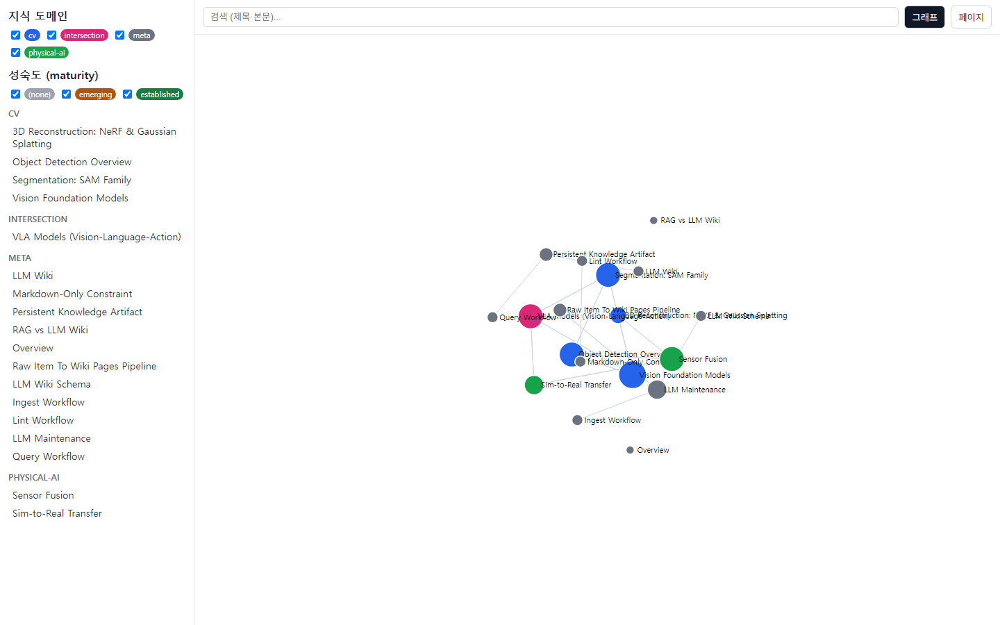

# LLM Wiki — 나만의 지식베이스 템플릿

Andrej Karpathy의 **LLM Wiki** 패턴을 Markdown + MCP 도구 + 그래프 뷰어로 구현한 **재사용 가능한 템플릿**이다. clone 한 뒤 자기 자료를 넣으면, AI agent가 읽고 정리해 **링크로 연결된 지식 그래프 위키**로 쌓아 준다.

핵심 아이디어: 자료를 매번 다시 검색·요약하는 대신, LLM이 한 번 읽고 **지속 갱신되는 위키 페이지**로 축적한다. 요약·링크·반론·미해결 질문이 채팅에서 사라지지 않고 파일로 남는다.


*위: 실제 지식베이스가 그래프 뷰어에 렌더링된 화면 (노드=페이지, 색=도메인, 엣지=Related 링크).*

---

## 30분 퀵스타트 — 자료 1건으로 첫 위키 페이지 만들기

처음 보는 사람이 30분 안에 **자기 자료 1건 → 첫 위키 페이지 → 화면 확인**까지 가는 경로다.

### 0. 사전 요구 (5분)

- **Python ≥ 3.10** (`python --version`)
- Git
- (선택) MCP 클라이언트: Claude Desktop — agent 연결용. 없어도 뷰어·CLI는 동작.

### 1. 설치 (5분)

```bash
git clone https://github.com/<you>/<your-wiki>.git
cd <your-wiki>/mcp-wiki
python -m venv .venv
# Windows: .venv\Scripts\activate   |   macOS/Linux: source .venv/bin/activate
pip install -e .          # MCP SDK 포함 (pyproject.toml)
```

검증: `python -c "import mcp_wiki, mcp; print('ok')"` → `ok`.

### 2. 자기 자료 넣기 (3분)

처리할 자료를 Markdown으로 `inbox/`에 둔다. (논문 요약, 강의 노트, 문서 발췌 등 무엇이든)

```bash
echo "# 내 자료\n\n핵심 내용..." > inbox/my-first-source.md
```

### 3. agent에게 통합 요청 (10분)

**MCP 연결 방식 (권장)** — Claude Desktop config(`%APPDATA%/Claude/claude_desktop_config.json`)의 `mcpServers`에 등록 후 재시작:

```json
{
  "mcpServers": {
    "my-wiki": {
      "command": "<.venv의 python 절대경로>",
      "args": ["-m", "mcp_wiki.server"],
      "env": { "WIKI_ROOT": "<레포 루트 절대경로>" }
    }
  }
}
```

그다음 자연어로 요청:

> "`inbox/my-first-source.md`를 ingest 해줘. `sources/`에 출처 노트 만들고 `wiki/concepts/`에 개념 페이지 생성해."

agent는 `create_page`로 페이지를 만들고 `index.md`·`log.md`를 자동 갱신한다. (권한·역할은 [에이전트 사양](mcp-wiki/04-agent-spec.md): **Wiki Guide**=읽기·질의, **Wiki Keeper**=편집.)

> MCP 클라이언트가 없으면: 위 형식대로 직접 `wiki/concepts/<domain>/<slug>.md`를 [페이지 템플릿](templates/page.md) 형식으로 만들면 된다. 제목 아래 `Domain: ... · Maturity: ...` 한 줄 필수.

### 4. 화면에서 확인 (5분)

```bash
cd mcp-wiki
python serve/build_site.py                  # site/ 생성 (markdown → 그래프+페이지+검색)
python -m http.server -d site 8000          # http://localhost:8000
```

브라우저에서 새 페이지가 그래프 노드로 뜨고, 도메인 색·maturity 필터·검색이 동작하면 성공.

---

## 제공하는 MCP Tool (6종)

핵심 루프 = 검색 → 읽기 → 목록 → 생성 → 갱신 → 점검. agent가 위키를 자유 편집하는 대신 이 tool들을 호출한다 (절차 강제 + 검증 가능). 자세한 근거: [mcp-wiki/README.md §1.1·§2.1](mcp-wiki/README.md).

| tool | 종류 | 동작 |
|---|---|---|
| `search_wiki` | read | 키워드로 페이지 본문·제목 검색, 발췌 반환 |
| `read_page` | read | 경로로 단일 페이지(frontmatter+본문) 읽기 |
| `list_pages` | read | 도메인/하위폴더별 페이지 목록 |
| `create_page` | write | 새 페이지 생성 + `index.md` 자동 등록 + `log.md` append |
| `update_page` | write | 기존 페이지 갱신 + 라인 delta를 `log.md`에 append |
| `link_check` | maintenance | 끊긴 내부 링크·색인 누락 탐지 리포트 |

불변조건(서버가 강제): 쓰기는 `wiki/` 내부만, kebab-case 이름, 덮어쓰기 금지(→ `update_page`), 도메인은 설정된 분류만.

---

## 검증 방법

```bash
cd mcp-wiki
# 1. 링크·색인 무결성
WIKI_ROOT=<레포 루트> python -c "import sys; sys.path.insert(0,'.'); from mcp_wiki.server import link_check; print(link_check())"
#    → {'broken_links': [], 'unindexed_pages': []} 이면 정상
# 2. 빌드 (파서가 페이지·엣지를 실증)
WIKI_ROOT=<레포 루트> python serve/build_site.py
#    → built N pages, M links
# 3. 서버 부팅 (stdio handshake)
WIKI_ROOT=<레포 루트> python -m mcp_wiki.server   # 6 tool 노출
```

---

## 너의 도메인으로 바꾸기

템플릿은 예시로 **cv / physical-ai / intersection** 분류를 둔다. 자기 주제로 바꾸려면 두 곳을 함께 수정:

1. `mcp-wiki/mcp_wiki/server.py`의 `_DOMAIN_HEADINGS` (도메인 키 → index 헤딩 매핑)
2. `index.md`의 `## Concepts — ...` 헤딩 (위 매핑과 문자열 일치해야 자동 등록 작동)

`wiki/concepts/<domain>/` 폴더와 뷰어 색(`serve/template.html`의 `COLORS`)도 취향껏.

---

## 무엇이 들어 있나

- **하네스** — agent 운영지침 + 추가 컨텍스트 + skill + hook:
  - [AGENTS.md](AGENTS.md): 운영 규칙 (역할, ingest/query/lint 절차).
  - [rules.md](rules.md): 추가 컨텍스트 (도메인 설정, 안전, 검증 게이트).
  - [mcp-wiki/skills/wiki-keeper/](mcp-wiki/skills/wiki-keeper/SKILL.md): Keeper 워크플로우 진입 skill.
  - [hooks/pre-commit](hooks/pre-commit): 커밋 전 `link_check` 강제 git hook (설치: `git config core.hooksPath hooks`).
- **LLM wiki** — [sources/](sources/README.md) (raw 출처) · [wiki/](wiki/overview.md) (정리된 지식) · [wiki/schema/](wiki/schema/llm-wiki-schema.md) (구조·불변조건) · [templates/](templates/page.md).
- **시각화 도구** — [mcp-wiki/mcp_wiki/](mcp-wiki/mcp_wiki/server.py) (MCP 서버 6 tool) + [mcp-wiki/serve/](mcp-wiki/serve/build_site.py) (그래프·페이지·검색 정적 뷰어).
- **데모** — [demo/demo.png](demo/demo.png).
- **설계 문서** — [mcp-wiki/](mcp-wiki/README.md) 01~06 (도메인 정의 / 의사결정 / PRD / 에이전트 / 하네스 / 접근 계획).

---

## 아키텍처 (한눈)

```
       markdown 파일 (source of truth)
        ┌──────────┴──────────┐
   MCP 서버 (mcp_wiki)      정적 뷰어 (serve/ → site/)
   = agent 연결 (6 tool)    = 사람 열람 (그래프·검색)
   Claude 등이 호출          브라우저로 봄
```

agent(편집·질의)와 뷰어(열람)가 같은 markdown을 공유한다. 한쪽에서 쓰고 다른 쪽에서 본다.

---

## 한계

- MVP는 키워드 검색만 (의미 검색·임베딩 미포함).
- 자동 정합성은 `link_check` 수준까지. 최신성·중복·출처 누락은 주기적 lint 필요.
- 페이지 삭제·동시 편집 미지원 (삭제는 수동 git).
