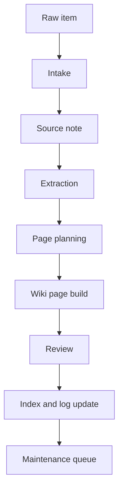

# Raw Item To Wiki Pages Pipeline

## Purpose

This pipeline explains how a raw item from `inbox/` or `sources/` becomes maintained LLM Wiki pages. It is based on the Agentic Coding Basics lectures, especially Plan Mode, Agent Specifications, Handoff Markdown, Harness Engineering, and Hooks.

## Pipeline Overview

## Stage 1: Intake

Goal: identify what the raw item is and whether it is safe to ingest.

Inputs:

- Raw Markdown text, extracted PDF text, or user-provided notes.
- File name, author, date, URL, and local source path when available.

Outputs:

- Source ID.
- Source metadata.
- Import decision.
- Any privacy or copyright concerns.

Handoff file:

- `sources/<pack>/<source-note>.md`

## Stage 2: Source Note

Goal: preserve evidence without turning the wiki into a dump of copied text.

The source note must include:

- Metadata.
- Short summary.
- Key claims.
- Useful details.
- Risks and open questions.
- Links to derived wiki pages.

## Stage 3: Extraction

Goal: extract reusable wiki units.

Extract:

- Concepts.
- Entities.
- Workflows.
- Claims.
- Contradictions.
- Procedures.
- Acceptance criteria.
- Terms requiring their own pages.

## Stage 4: Page Planning

Goal: decide where knowledge belongs before writing.

Rules:

- Existing page first, new page second.
- If a concept appears in three or more source notes, create a dedicated concept page.
- If the item describes steps, create or update a workflow page.
- If the item describes operating rules, update `AGENTS.md` or schema docs.
- If the item describes maintenance behavior, update [LLM Maintenance](../workflows/maintenance.md).

## Stage 5: Wiki Page Build

Goal: create concise, linked, source-backed pages.

Each wiki page should include:

- Definition.
- Why it matters.
- Operating rules or comparison.
- Failure modes.
- Source notes.
- Related links.

## Stage 6: Review

Goal: prevent the LLM Wiki from accumulating silent errors.

Reviewer checks:

- Does every strong claim link to a source note?
- Are there duplicate pages?
- Are internal links valid?
- Are unresolved conflicts marked?
- Did the page preserve the markdown-only constraint?
- Is `index.md` updated?
- Is `log.md` updated?

## Stage 7: Maintenance Queue

Goal: leave future work visible.

If the item creates unresolved work, add it to:

- `TASK.md` for concrete completion work.
- `journal.md` for append-only activity history.
- `index.md` Open Questions for conceptual uncertainty.

## Agent Roles

| Role | Responsibility | Output |
| --- | --- | --- |
| Intake Agent | Classify raw item and metadata | source note skeleton |
| Extractor Agent | Pull claims, concepts, workflows | extraction notes inside source note |
| Page Builder | Create or update wiki pages | `wiki/**/*.md` |
| Reviewer | Validate schema, links, and source coverage | review notes or fixes |
| Maintainer | Update index, log, task, journal | repository state |

## Done When

- Source note exists.
- At least one linked wiki page exists or is updated.
- `index.md` includes the new source and pages.
- `log.md` has an entry.
- Maintenance issues are recorded.
